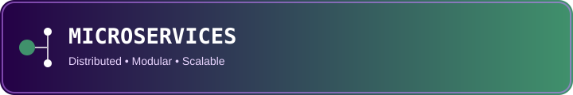
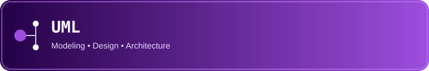
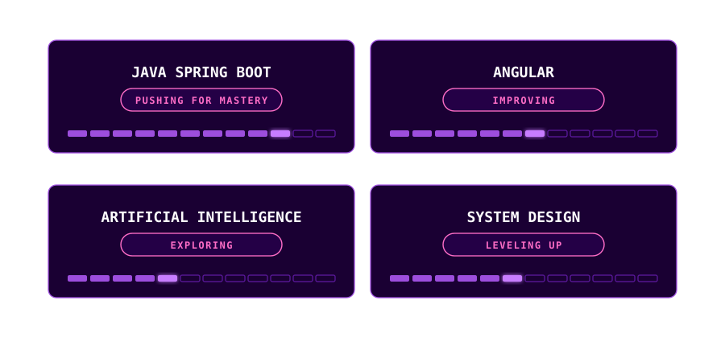
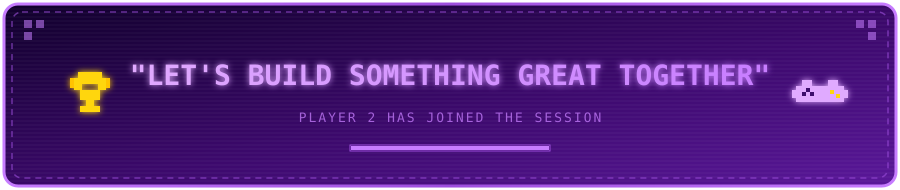

 

 

 

<table>
<tr>

<td width="30%" align="center">

 

 

</td>

<td width="70%">

 

 

 

</td>

</tr>
</table>

---

<table>
<tr>
<td width="50%" valign="top">

  

 

         

</td>
<td width="50%" valign="top">

  

 
 

</td>
</tr>
<tr>
<td width="50%" valign="top">

  

          

 

</td>
<td width="50%" valign="top">

  

 

</td>
</tr>
<tr>
<td width="50%" valign="top">

  

</td>
<td width="50%" valign="top">

  

</td>
</tr>
</table>

---

<table>
<tr><td width="50%" valign="top">

- Contributed to a **multi-tenant SaaS platform** based on a **microservices architecture**, including HR management, authentication, notifications and configuration
- Developed backend microservices and REST APIs using **Spring Boot** and **ASP.NET Core Web API**, with **PostgreSQL** and **SQL Server** for data persistence
- Developed the frontend and the configurable tenant showcase using **Angular**, and integrated **Kong** as an API Gateway, **MinIO** for object storage and **RabbitMQ** for asynchronous messaging
- Containerized the application with **Docker** and managed version control using **Git/GitLab** with **GitFlow** in an Agile/Scrum environment with **Jira**

</td><td width="50%" valign="top">

- Contributed to an **intelligent recruitment platform** connecting candidates, job opportunities and company needs
- Developed AI related features with **Python** and **FastAPI** for CV analysis and matching, within a **RAG** oriented workflow, using **AWS Bedrock models** and **Amazon Titan Text Embeddings**.
- Developed frontend features with **Next.js**, managed application data with **PostgreSQL**, used **AWS S3** for file storage, containerized the backend with **Docker**, and collaborated using **Git/GitHub** and **GitFlow** in an Agile/Scrum environment with daily meetings

</td></tr>
<tr><td width="50%" valign="top">

- Contributed to a **leave management application** built as a **monolithic REST API** secured with **JWT** authentication
- Developed backend features using **Spring Boot** and **Maven**, with **PostgreSQL** for data persistence
- Collaborated through **Git/GitHub**

</td><td width="50%" valign="top">

- Contributed to separate **Java** and **C++** console applications, with the Java application following an **MVC** architecture, for administrative and sales management
- Contributed to a web application using **PHP**, **HTML**, **CSS** and **JavaScript** for reservation and sales management
- Managed version control using **Git/GitHub** and **ClickUp** for task management

 

 

</td></tr>
</table>

---

 

---

 

---

 

  

